# 클론 코딩 프로젝트

<br/>

## 프로젝트 개요 

### 프로젝트 주제

> **커피 상품을 주문할 수 있는 <u>주문 관리 프로젝트</u> 클론 코딩**

### 프로젝트 개발환경

```
• 언어 : Java 11
• 프레임워크 : SpringBoot 2.5.4
• 빌드도구 : Maven
• IDE : IntelliJ IDEA Ultimate
• 데이터베이스 : MySQL
```

### 사용 기술

<p align="left">
  </a>
  </a>
  
  </a>
	</a>
  </a>
  </a>
</p>
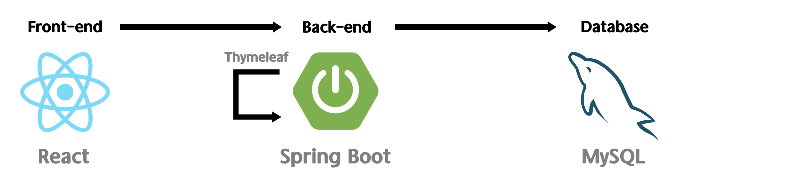

<br/>

## 요구사항 

> **관리자**

- [x] 상품 조회, 추가, 변경, 삭제
- [x] 고객 주문 목록 조회
- [ ] 주문 처리 (주문에 대한 승인)

> **고객**

- [x] 상품 조회
- [x] 원하는 상품을 담아 이메일, 주소, 우편번호를 입력 후 주문
  - 따로 회원을 구분하지 않고 이메일로 고객 구분
- [ ] 자신의 주문 목록 조회 (주문 상태 & 주문 내역 확인)

<!-- 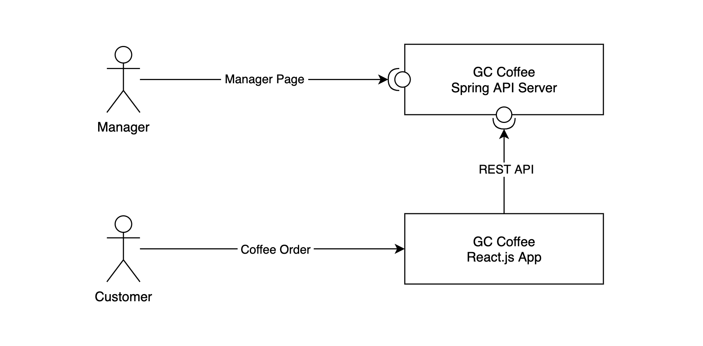-->

<br/>

## 구현 화면

> **관리자 페이지**

##### 상품 추가하기

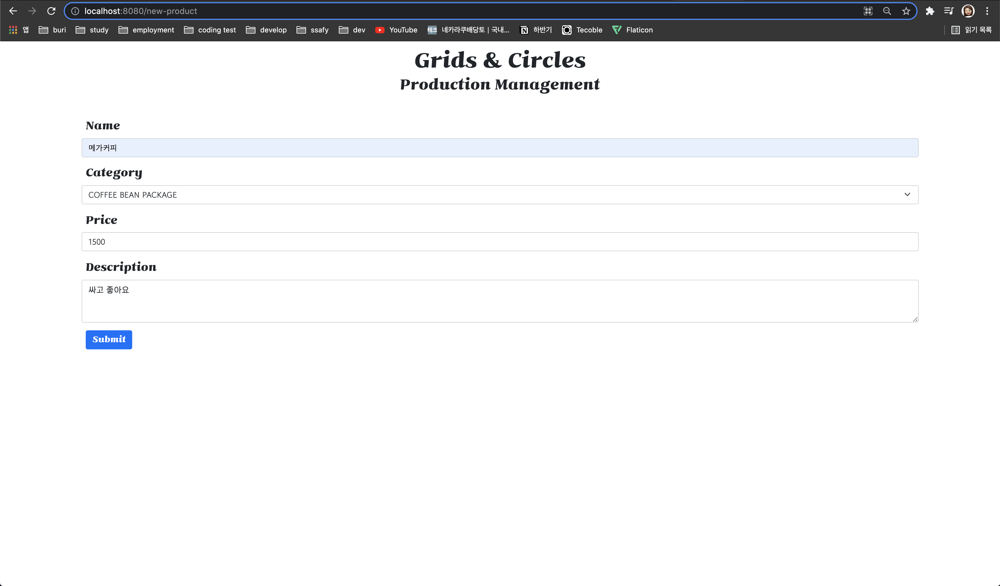

##### 상품 조회하기

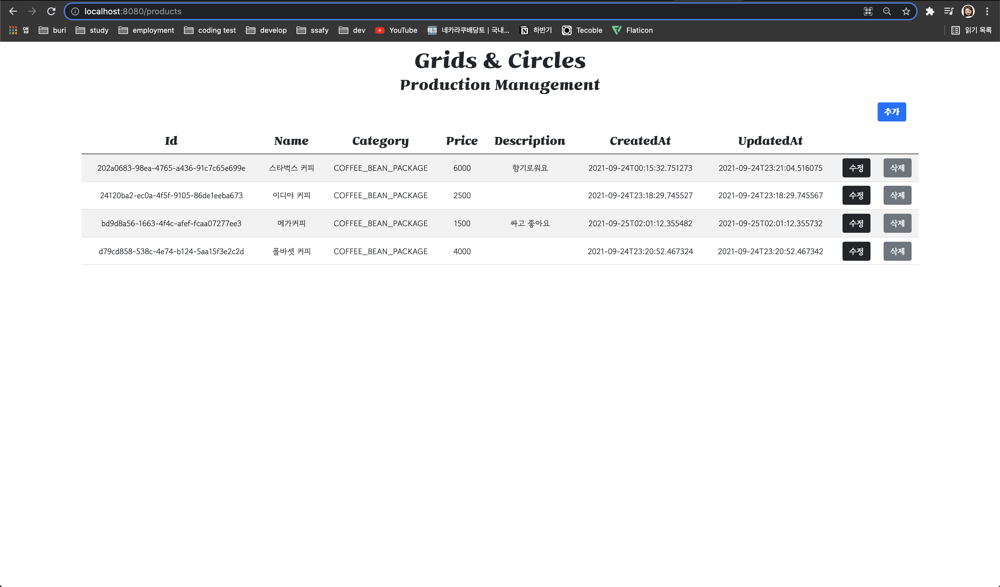

##### 상품 변경하기

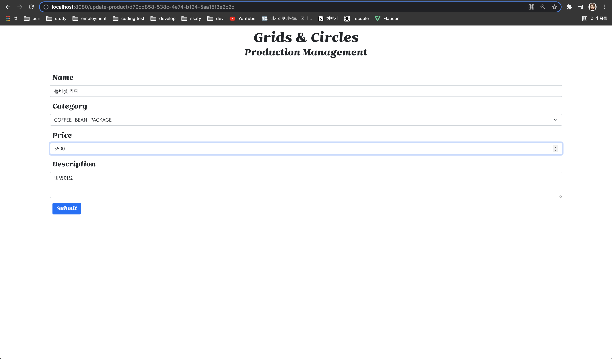

##### 상품 변경 확인(조회)

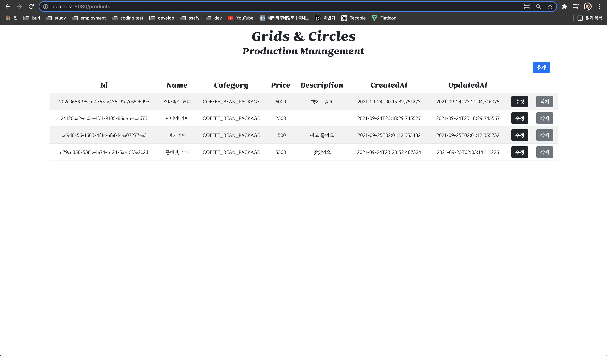

##### 상품 삭제하기

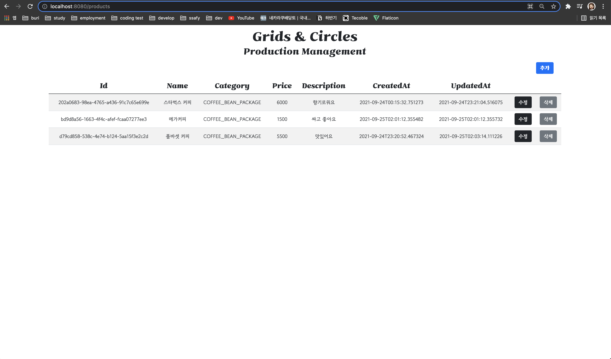

##### 주문 목록 조회

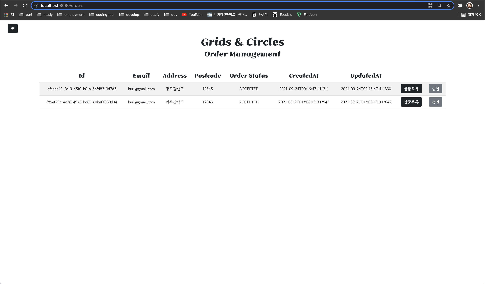

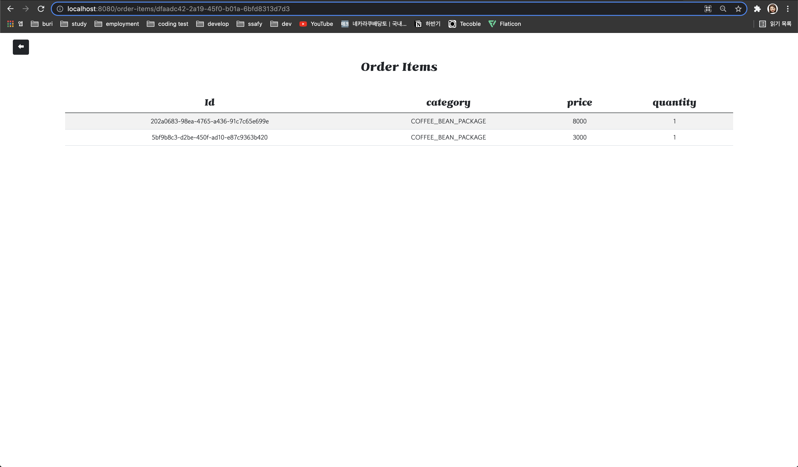

> **고객 페이지**

##### 상품 조회하기

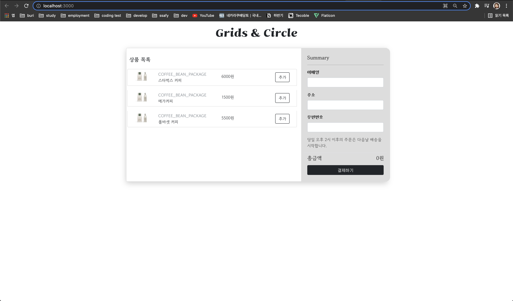

##### 상품 주문하기

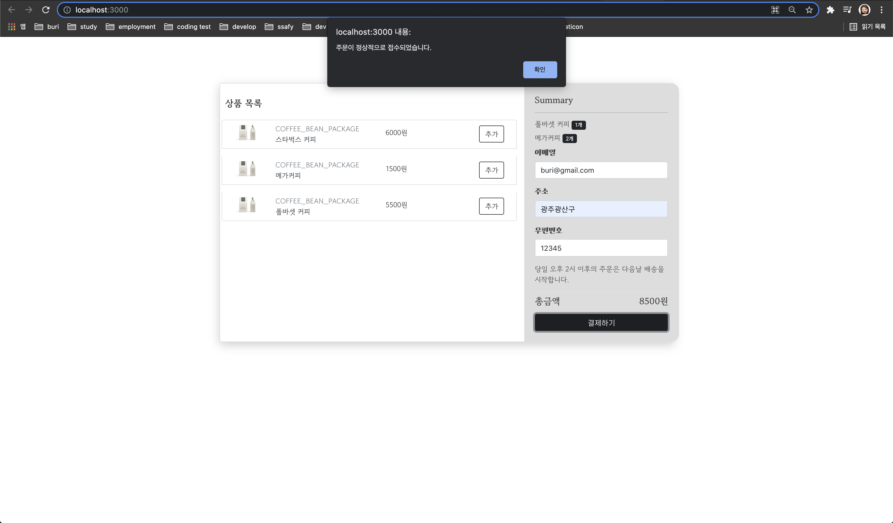
