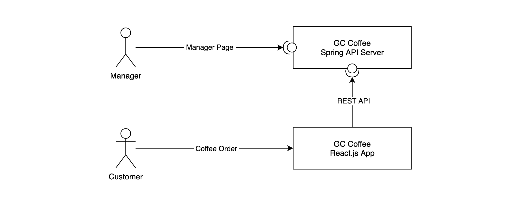

# 클론 코딩 프로젝트

## 프로젝트 : 

> **커피 상품을 주문할 수 있는 상품 관리 프로젝트**

#### 기능 요구사항 

---

###### 1. email로 고객을 구분하여, 주문을 받을 때 email을 같이 받아서 주문을 받습니다.

###### 2. 하나의 email로 하루에 여러 번 주문을 받더라도 하나로 합쳐서 다음 날 배송을 보내면 됩니다. 

###### 3. 고객에게 '당일 오후 2시 이후의 주문은 다음 날 배송을 시작합니다.'라고 알려줍니다.

---

